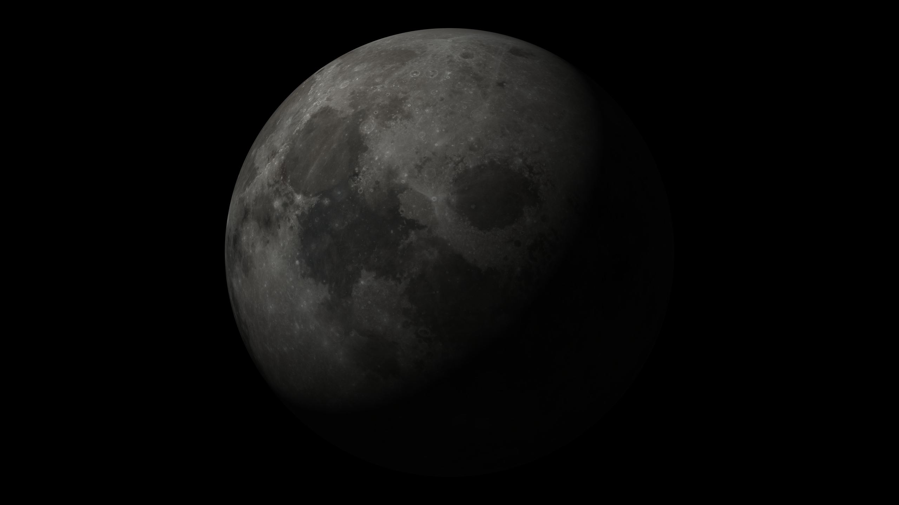
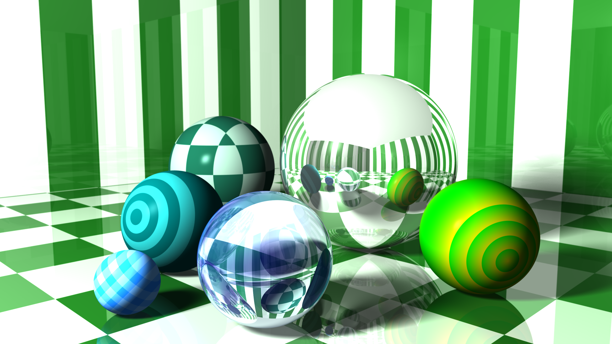

# RayB Tracer

This is a simple Ray Tracer written in TypeScript.
I got started with this pet-project by following the test driven approach described in [The Ray Tracer Challenge](http://raytracerchallenge.com/) by Jamis Buck. (..which by the way is a book I highly recommend to everyone)

## Installation

Run tests with `npm test`

Run with `npm run dev`

# Rendered scenes

## Marbles

Marbles with reflective and refractive surfaces rendered with a shallow depth of field, 8x8 super sampling, area light casting soft shadows.

## Teapot

Basic support for the OBJ file format

## Texture mapping

Planar, spherical, cylindrical and cubic texture mapping

## Skybox

A skybox with reflective spheres

_Photo used for skybox by [Emil Persson](http://www.humus.name)_

## Constructive Solid Geometry

Constructing letters by applying union, difference or intersection on cylinders and cubes

## Transformations

Constructing a dodecahedron by translating, scaling and rotating cylinders and spheres

## Image mapping

Currently only capable of image mapping. Bump mapping is next on the list

Image by [NASA](https://svs.gsfc.nasa.gov/cgi-bin/details.cgi?aid=4720)

## 3D Patterns

Stripes, gradients, checkers and blended patterns

